<h1 align="center">Hi, I'm Han Chen 👋</h1>

  First-year CS PhD student at the National University of Singapore 
  MLSys · Agent Memory

  
  
  
  
  

  
  
  

---

I'm a first-year CS PhD student at the National University of Singapore, supervised by [Prof. HE Bingsheng](https://www.comp.nus.edu.sg/~hebs/). My research focuses on MLSys — speeding up LLM inference. Before that, my work centered on high-performance computing, including LAPACK subroutine optimization, LLM inference optimization, and high-throughput encryption algorithm design. I've also won a silver medal at ICPC and a bronze medal at the ICPC East Continental Final.

For more details, you're welcome to take a look at my [CV](https://concyclics.github.io/resume/latex/resume.pdf).

  
  

